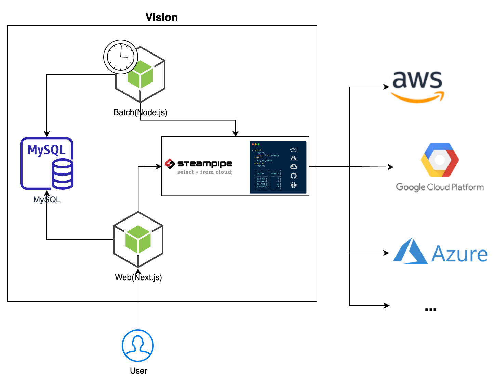
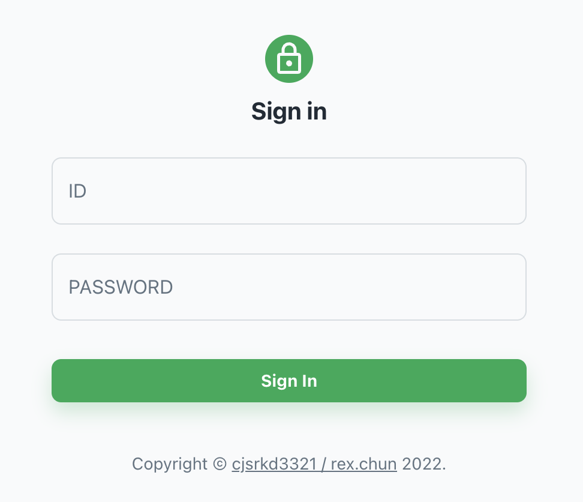
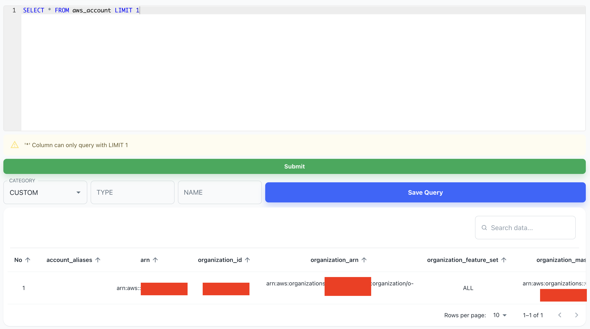
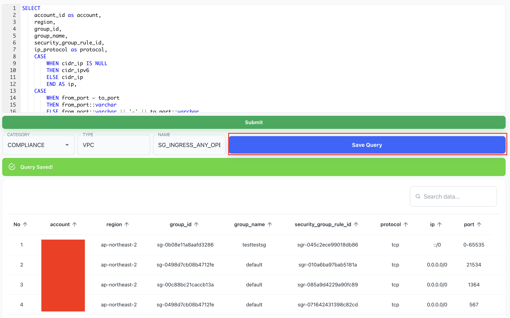
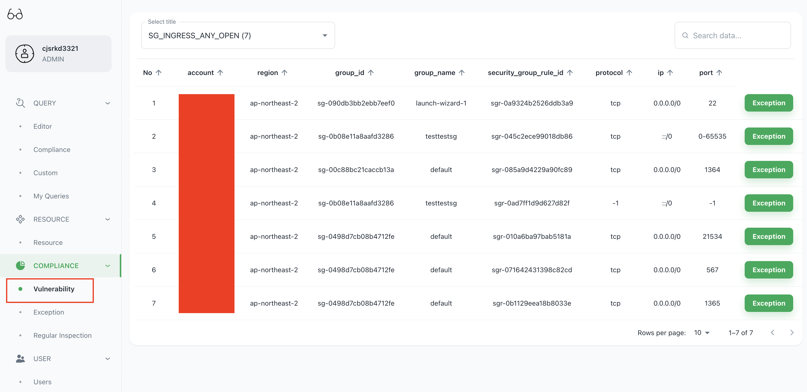
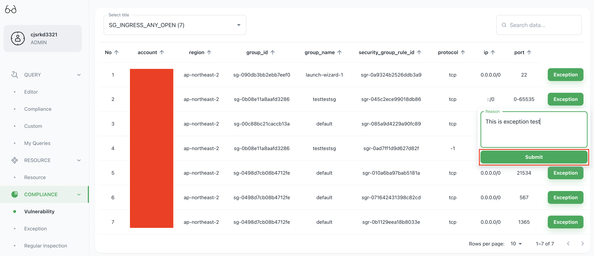
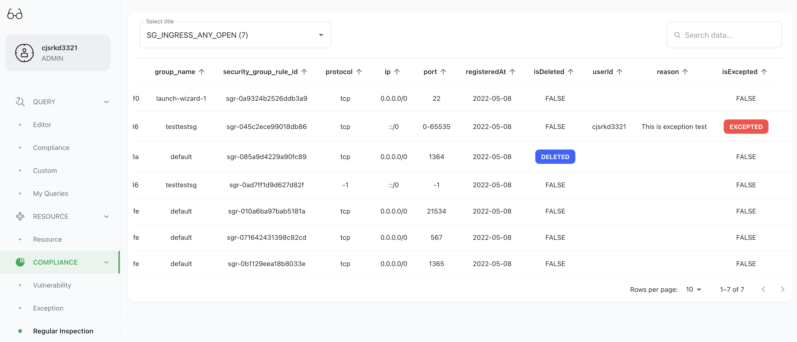
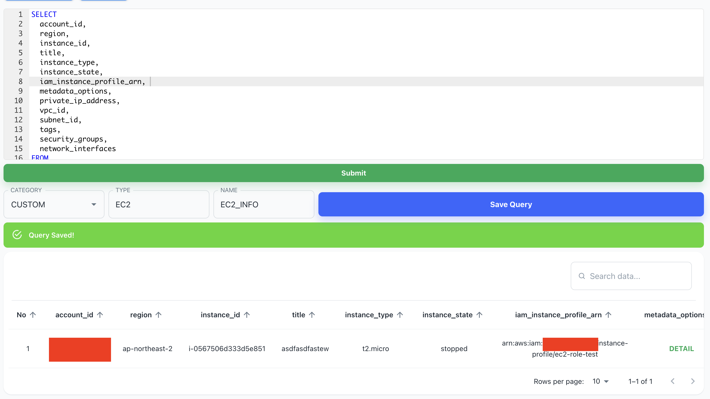

[ENGLISH](./README.md)
| [한국어](./README-ko.md)

# Vision

- 클라우드 현황에 대해 쿼리를 통한 현황 관리와 보안상 취약한 결과들을 종합하여, 예외처리/삭제 등에 대한 이력을 관리 가능한 시스템입니다.

_목차:_

- [SImple Architecture](#simple-architecture)
- [Tech Stacks](#tech-stacks)
- [Usage](#usage)
- [Additional Information](#additional-information)
  - [Menu](#menu)
    - [QUERY](#query)
    - [RESOURCE](#resource)
    - [COMPLIANCE](#compliance)
    - [USER](#user)
    - [COMMON(Not menu)](#common)
  - [Settings](#settings)
- [FAQ](#faq)
  - GCP, Azure 등 다른 클라우드에서도 사용 가능한가요?
  - 우리 회사는 SSL 가시화 장비를 사용하고 있습니다. npm 패키지들 설치를 어떻게 해야할까요?
  - PostgreSQL 초보자입니다. 쿼리를 작성하기 위해 뭘 해야될까요? 🥲
  - 쿼리 주기를 변경하고 싶습니다. 어떻게 해야합니까?
- [Special Thanks](#special-thanks)

## Simple Architecture



## Tech Stacks

- Next.js + Node.js + MySQL + Steampipe + Prisma(ORM)

## Usage

- 첫번째로, steampipe 디렉토리 내부에 시스템 사용을 위한 [크레덴셜 설정법](https://hub.steampipe.io/plugins/turbot/aws)을 알아야 합니다.
- 그러나, 단지 자신의 PC에서 테스트를 하기 위해서라면 아래 가이드를 참고 부탁드립니다.
  - 만약 하나의 계정에서 테스트하고 싶다면 steampipe 디렉토리 내부의 aws.spc, config, credentials 파일들에서 sub1 이 포함된 정보들을 삭제해야 합니다.

```bash
# Current /steampipe/config file
[default]
region = ap-northeast-2
output=json

[sub1]
region = ap-northeast-2
output=json
```

- credentials 파일을 아래와 같이 생성하고 셋팅합니다.

```bash
# /steampipe/credentials file
[default]
aws_access_key_id = AKIA...
aws_secret_access_key = SECRET_ACCESS_KEY

[sub1]
aws_access_key_id = AKIA...
aws_secret_access_key = SECRET_ACCESS_KEY
```

- aws.spc 파일을 수정하고 싶다면 하셔도 됩니다.

```bash
# /steampipe/aws.spc file
connection "aws_master" {
  plugin  = "aws"
  profile = "default"
  regions = ["ap-northeast-2"]

  options "connection" {
    cache     = false # true, false
    cache_ttl = 300  # expiration (TTL) in seconds
  }
}

connection "aws_sub1" {
  plugin    = "aws"
  profile   = "sub1"
  regions   = ["ap-northeast-2"]

  options "connection" {
    cache     = false # true, false
    cache_ttl = 300  # expiration (TTL) in seconds
  }
}

connection "aws_all" {
  plugin      = "aws"
  type        = "aggregator"
  connections = ["aws_master", "aws_sub1"]
}
```

- 이제 최상위 디렉토리에서 ./run.sh을 실행시켜 줍니다.

```bash
# You have to install Node.js, docker
# And run the docker on your local machine
# before run this command below
$ ./run.sh
```

- 마지막으로, 어플리케이션의 상태를 점검해줍니다.

```bash
$ docker logs vision

...
2022/05/08 01:37:30 Problem with dial: dial tcp 172.21.0.2:3306: connect: connection refused. Sleeping 1s
...
> vision@0.1.0 start
> next start

ready - started server on 0.0.0.0:3000, url: http://localhost:3000
info  - Loaded env from /usr/src/app/.env
```

- 상태가 위와 같이 나온다면 http://localhost 로 접근합니다.(크롬 권장)
- 그러면, 아래와 같은 화면을 보게됩니다.
  
  - **[IMPORTANT] 처음 로그인하는 사용자가 ADMIN이 됩니다.**
- 로그인 후 초기에 쿼리 페이지를 보게됩니다.
  
- 초기 상태에서 'Submit' 버튼을 누르거나 ctrl(command) + enter를 눌러 결과를 확인합니다.
  
- 아래와 같이 쿼리를 수정합니다.

```sql
SELECT
    account_id as account,
    region,
    group_id,
    group_name,
    security_group_rule_id,
    ip_protocol as protocol,
    CASE
        WHEN cidr_ip IS NULL
        THEN cidr_ipv6
        ELSE cidr_ip
        END AS ip,
    CASE
        WHEN from_port = to_port
        THEN from_port::varchar
        ELSE from_port::varchar || '-' || to_port::varchar
        END AS port
FROM
    aws_vpc_security_group_rule
WHERE
    type = 'ingress'
    AND (cidr_ip = '0.0.0.0/0' OR cidr_ipv6 = '::/0')
```

- 결과를 확인하고 CATEGORY는 'COMPLIANCE', TYPE은 'VPC', NAME은 'SG_INGRESS_ANY_OPEN' 으로 변경하고, 'Save Query' 버튼을 클릭합니다.
  
- 왼쪽 사이드바에서 'Vulnerability' 메뉴를 선택하고, 쿼리 결과를 확인합니다.(결과가 없다면 최대 10초 정도 기다려주세요.)
  
  - **[IMPORTANT] The current setting runs a saved query every 10 seconds and synchronizes the results every 300 seconds**
- 만약 취약한 결과에 대해 예외처리를 하고 싶다면 'Exception' 버튼을 누르고, 예외사유를 입력한 후 전송합니다.
  
- 삭제/예외여부를 왼쪽 사이드바의 'Regular Inspection' 메뉴에서 확인 가능합니다.
  
- 이제 'CUSTOM' 쿼리를 등록해봅니다. 'Editor' 메뉴를 클릭하고 아래 쿼리를 입력합니다.

```sql
SELECT
  account_id,
  region,
  instance_id,
  title,
  instance_type,
  instance_state,
  iam_instance_profile_arn,
  metadata_options,
  private_ip_address,
  vpc_id,
  subnet_id,
  tags,
  security_groups,
  network_interfaces
FROM
  aws_ec2_instance
```

- 'Submit' 버튼을 클릭한 후, CATEGORY는 'CUSTOM' / TYPE은 'EC2' / NAME은 'EC2_INFO' 를 입력하고 저장합니다.
  
- 이제 'Resource' 메뉴에서 관련 정보를 확인할 수 있습니다.

## Additional information

### Menu

#### QUERY

- Editor
  - 쿼리를 편집합니다.
  - 초기 접근 시 테이블들의 목록을 확인 가능합니다.
  - 원하는 쿼리를 질의 가능합니다.
  - 쿼리를 'CUSTOM' 또는 'COMPLIANCE' 카테고리 지정 후 저장합니다.
    - 이때, COMPLIANCE는 ADMIN만 사용가능합니다.
- Compliance
  - 다른 사람들이 만든 COMPLIANCE 쿼리들을 전부 확인 가능합니다.
- Custom
  - 다른 사람들이 만든 CUSTOM 쿼리들을 전부 확인 가능합니다.
- My Queries
  - 당신이 만든 모든 종류의 쿼리들을 확인 가능합니다.
  - USER는 최대 5개의 쿼리만 생성 가능합니다.

#### RESOURCE

- Resource
  - 'CUSTOM' 쿼리의 결과들을 확인 가능합니다.

#### COMPLIANCE

- Vulnerability
  - 'COMPLIANCE' 쿼리의 결과들을 확인 가능합니다.
  - 그러나, 예외/삭제된 결과는 확인이 불가능합니다.
- Exception
  - 예외처리된 결과들을 확인 가능합니다.
  - 그러나, 삭제된 결과는 보이지 않습니다.
- Regular Inspection
  - 정기점검을 위해 사용합니다.
  - 모든 종류의 결과를 볼 수 있습니다.(삭제/예외 결과 포함)
  - 만약 2022년 2분기 결과를 확인하고 싶다면 검색 창에 아래와 같이 입력합니다.
    - OR: 2022-04 || 2022-05 || 2022-06

#### USER

- Users

  - 사용자를 관리합니다.
  - 사용자에게 ADMIN 권한을 부여 가능합니다.(ADMIN만 가능)
  - 그러나, 등급을 하향할 수 없습니다.
  - 등급 하향은 오직 아래 명령을 통해 직접 DB를 통해서만 가능합니다.

    ```bash
    $ cd batch
    $ npx prisma studio

    Need to install the following packages:
    prisma
    Ok to proceed? (y) y
    Environment variables loaded from .env
    Prisma schema loaded from prisma/schema.prisma
    Prisma Studio is up on http://localhost:5555

    # Open your browser automatically
    ```

    - 동작하지 않나요? /batch/.env 파일의 DATABASE_URL 환경변수를 환경에 맞게 수정 후 다시 시도 합니다.

#### COMMON

- Search
  - AND: 123 && 456
  - OR: 123 || 456
    - ex) OR: DELETED || EXCEPTED

### Settings

- 쿼리 주기 변경

```bash
# run.sh
if [ -f ".env" ]; then
    echo ".env File exists."
else
    ...
    # Modified this value
    echo SP_TTL=300 >> .env
fi

docker-compose build
docker-compose up -d

docker rmi $(docker images -f "dangling=true" -q)
```

- Credentials
  - [이 링크](https://hub.steampipe.io/plugins/turbot/aws)를 참고합니다.
  - 만약 당신의 계정에서 테스트하고 싶다면 steampipe 디렉토리에 config, credentials, aws.spc 파일들을 수정합니다.
    - aws_sub1 과 관련된 모든 데이터를 삭제합니다.

## FAQ

- GCP, Azure 등 다른 클라우드에서도 사용 가능한가요?
  - 가능합니다. 하지만 /steampipe/Dockerfile을 수정해야하고, 다른 여러 파일들을 생성해야합니다.
    1. steampipe plugin install aws(or gcp or azure etc...)
    2. 만약 GCP를 사용하고 싶다면, 크레덴셜을 [이 링크](<(https://hub.steampipe.io/plugins/turbot/gcp)>)를 참조하여 변경합니다.
- 우리 회사는 SSL 가시화 장비를 사용하고 있습니다. npm 패키지들 설치를 어떻게 해야할까요?
  - "NODE_EXTRA_CA_CERTS" 환경변수를 설정합니다.
  - [이 링크](<(https://stackoverflow.com/questions/13913941/how-to-fix-ssl-certificate-error-when-running-npm-on-windows)>)를 참조하세요.
- PostgreSQL 초보자입니다. 쿼리를 작성하기 위해 뭘 해야될까요? 🥲
  1. Simple query samples are [here](https://steampipe.io/docs)
  2. Advanced queries are [here](https://hub.steampipe.io/plugins/turbot/aws/tables)
  3. PostgreSQL docs are [here](https://www.postgresql.org/docs/)
  4. 추가적인 쿼리 샘플은 /batch/src/quries 에 있습니다.
- 어플리케이션을 어떻게 실행해야할지 모르겠어요. 😰
  - 만약 당신이 충분히 문제들에 대해 검색해봤다면, 이슈를 열어주세요.
    - 당신은 "무엇을 시도했습니까?", "언제 오류가 발생합니까?", "콘솔에 오류가 표시됩니까?", "스크린샷을 이용해 상태를 제출하세요." 와 같은 추가 정보들을 필수로 제출해야 합니다.
- 쿼리 주기를 변경하고 싶습니다. 어떻게 해야합니까?
  - 먼저 300초로 설정된 값은 두 곳에 존재합니다.
  - steampipe cache time(ttl) : /steampipe/aws.spc
    - 이곳에서 값을 변경하면 결과값을 캐싱하는 시간이 달라집니다.
    - 영향받는 메뉴는 'Editor' 메뉴입니다.(직접 쿼리를 수행할 때)
  - /.env SP_TTL
    - 이곳에서 값을 변경하면 'batch' 서버에서 steampipe에 질의하는 주기가 달라집니다.
    - 영향받는 메뉴는 거의 모든 메뉴입니다.
  - 하나의 예시로, 'Editor' 쿼리는 실시간 / 다른 메뉴의 결과는 5분마다 갱신하고 싶다면 아래와 같이 설정합니다.
    - /steampipe/aws.spc : cache = false / cache_ttl = 0
    - /.env : SP_TTL=300

## Special Thanks

- [steampipe](https://github.com/turbot/steampipe)
- [steampipe-plugin-aws](https://github.com/turbot/steampipe-plugin-aws)
